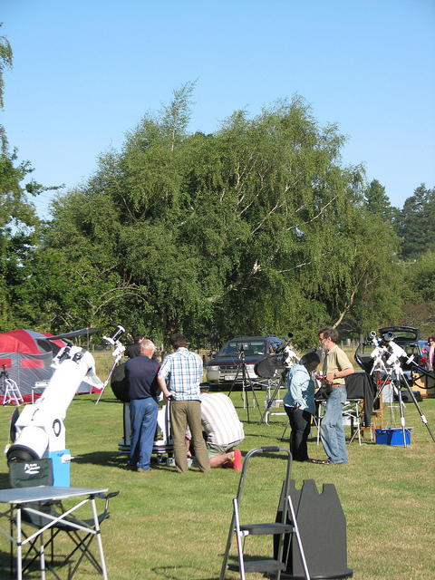
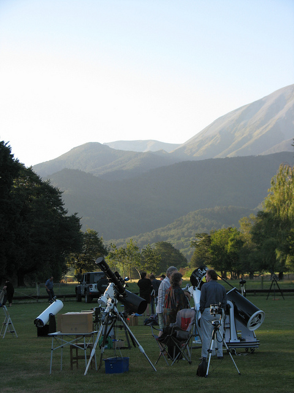

It's time to register for Stardate SI, which will be held over a three day
weekend from Feb 5-8.  Dr Grant Christie is our special guest. Enjoy the
friendship of fellow astronomers under an ink-black sky, hear talks, and relax
in a holiday setting.

Stardate SI is an annual star party held at a dark sky site at Staveley in
inland Canterbury between Methven and Geraldine.  In 2016 Stardate SI takes
place between Fri Feb 5th and Mon Feb 8th.

Stardate SI is  held at a hostel and campsite. It has the following facilities:

- Full toilet & showers
- Bunkrooms
- An auditorium Kitchens with shared fridges and freezers
- A large cafeteria
- Plenty of space for tents and caravans

The viewing area has excellent horizons in all directions, and space for many
telescopes.

The surrounding countryside is beautiful, with fine walks through beech forests.

For more details and registration, please visit the [camp website](http://treesandstars.com/stardate/)

