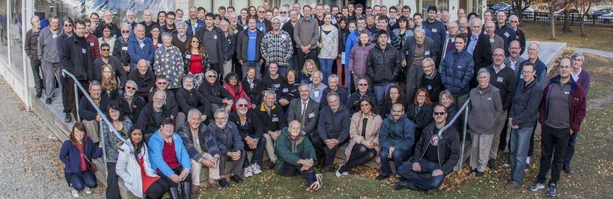
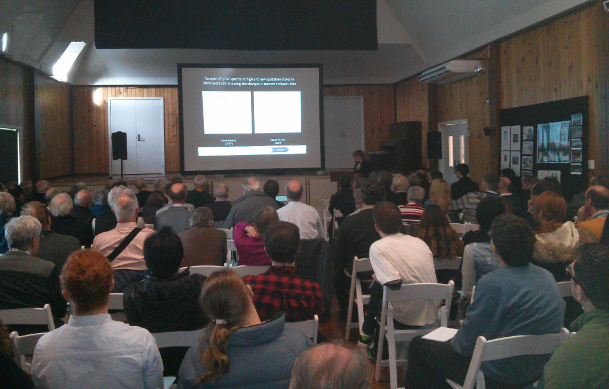

We are pleased to report that the 2015 RASNZ conference, co-hosted by
the University of Canterbury Physics and Astronomy Department and CAS, was a
great success.

Around 140 attendees packed the Tekapo community hall for a variety variety of
speakers, many of them current or former CAS members.

Some highlights of the conference:

- Day and night-time tours of the facilities at Mount John.
- Excellent speakers from around the globe, including keynotes from Gerry
  Gilmore, PI of the ESA Gaia project, Stella Kafka, director of the AAVSO and 
  Ed Guinan from Villanova University, Philadelphia.
- 2 CAS members where presented with awards from the RASNZ. Our congratulations
  to Brian Loader (elected a Fellow of the RASNZ) and Graeme Kershaw (2015
  Murray Geddes medal).
- Musical entertainment for the conference dinner from Rhiannon and Euan Mason,
  one of whom is also known for his other work as CAS president!

As part of a scheme called ‘Students with a passion for astronomy’ 16 students
where given free tickets to the conference.  Many of these students have joined
CAS.

Thanks to all the CAS members who helped with organising the conference, and
to all the attendees and speakers who helped make the conference such an
enjoyable event.  We look forward to the next time we have the privilege to
host the conference.

